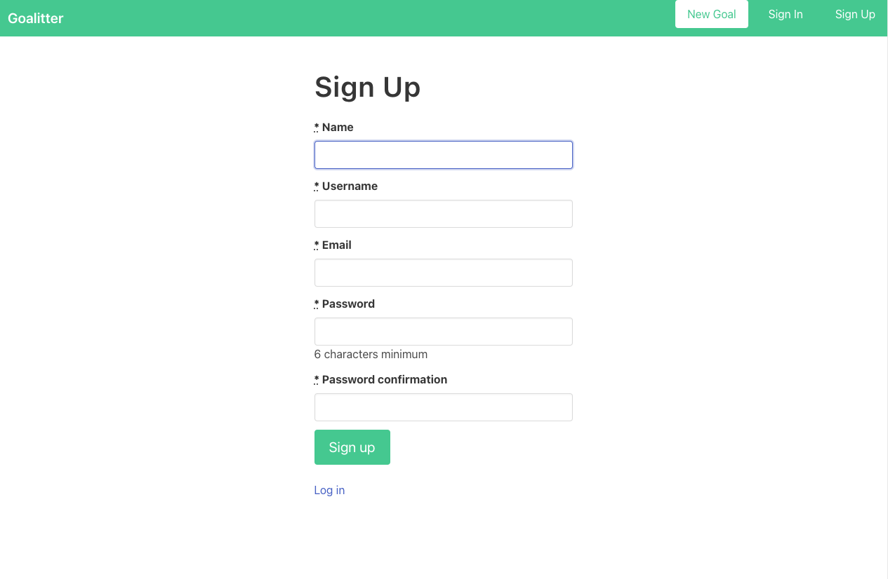
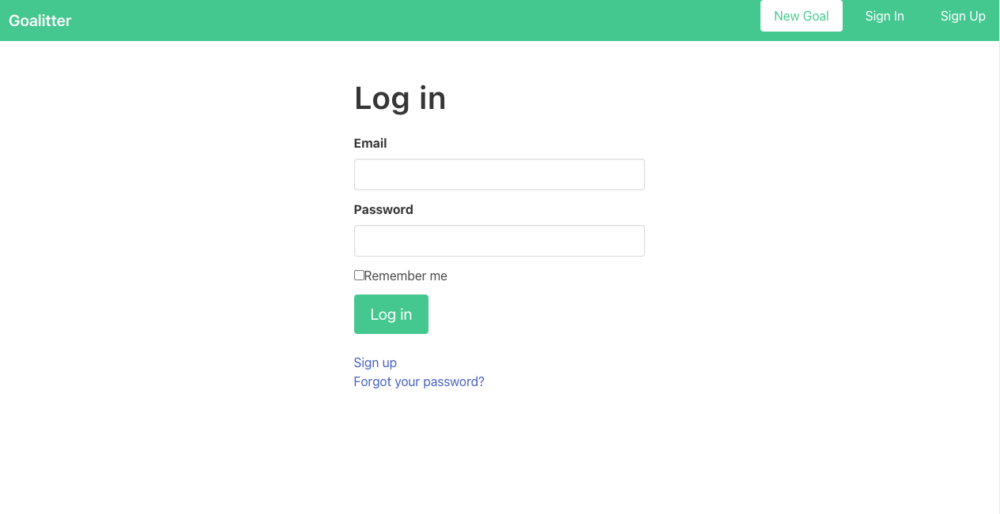
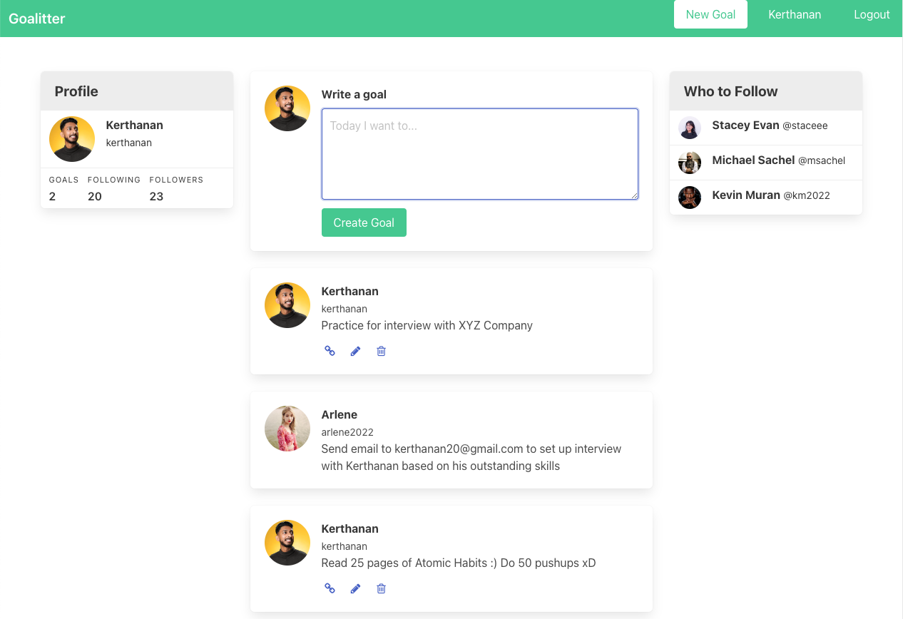
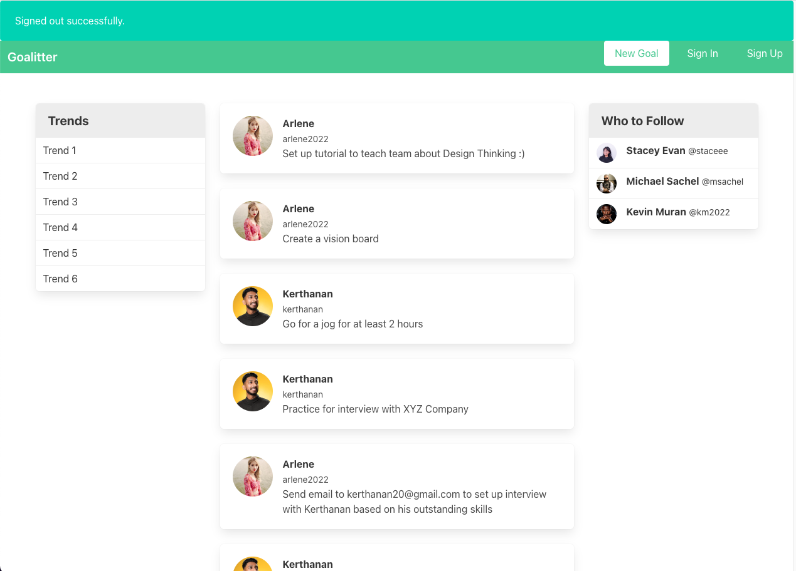

# Goalitter

A Twitter for personal goals. Goalitter is a web application that was built on the concept of accountability. Users can make an account and post their goals for the day. By posting publicly, users will feel a sense of accountability to achieve such goals. Users can create, read, update and destroy goals seamlessly ;) Other users can also sign up and post their own goals and see goals of those they follow (useful for inspiration).

## How it was built

It all started in 2022 when I started dabbling with Ruby on Rails. Goalitter was built using the Ruby on Rails framework for efficiency using the MVC model. Additionally, Bulma was explored and used for styling.

## Screenshots

|    Sign Up    |     Sign In      |
|:-------------:|:---------------:|
|  |  |

| Logged In HomePage |   Logged Out HomePage    |
|:-------------:|:----------:|
|  |  |
